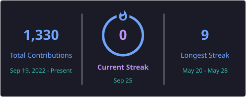

  

---

# 👋 About Me

I'm a **Senior QA Engineer with 13+ years of experience** in Manual and Automation Testing, currently expanding my expertise into **DevOps and Cloud Engineering** through hands-on projects, real-world implementations, and continuous learning.

My experience in Software Quality Engineering has given me a strong foundation in automation, problem-solving, Agile methodologies, software delivery, and continuous improvement. I'm now applying these skills to build scalable cloud infrastructure, automate deployments, create CI/CD pipelines, and work with modern DevOps technologies.

I successfully completed the **90 Days of DevOps** challenge, where I gained practical experience with Linux, Docker, Kubernetes, Terraform, Jenkins, GitHub Actions, Ansible, Helm, Prometheus, Grafana, AWS, and modern DevOps workflows.

Currently, I'm strengthening my practical experience through the **CBC-BAN DevOps Internship** and the **10 Weeks of AWS** program by building production-style DevOps projects and cloud solutions.

---

### 🚀 Current Focus

- 🚀 CBC-BAN DevOps Internship
- ☁️ 10 Weeks of AWS

💼 **Open to DevOps Engineer, Cloud Engineer, Platform Engineer, and Site Reliability Engineer (SRE) opportunities.**

---

# 🛠️ Tech Stack

## ☁️ Cloud

- AWS

---

## 🐳 Containers & Orchestration

- Docker
- Kubernetes
- Helm
- Amazon EKS
- Kind
- Minikube

---

## 🏗️ Infrastructure as Code & Automation

- Terraform
- Ansible
- Bash Scripting

---

## ⚙️ CI/CD & Version Control

- GitHub Actions
- GitLab CI/CD
- Jenkins
- Git
- GitHub

---

## 📊 Monitoring

- Prometheus
- Grafana

---

## 💻 Operating Systems & Programming

- Linux
- Ubuntu
- Windows
- WSL
- Bash
- Python
- Visual Studio Code

---

# 🚀 Featured Projects

## 🏦 AI BankApp DevOps

An end-to-end DevOps implementation for a Spring Boot banking application, demonstrating modern software delivery using Docker, Kubernetes, Helm, Terraform, AWS EKS, and CI/CD automation.

### Technologies

`AWS` • `Amazon EKS` • `Docker` • `Kubernetes` • `Helm` • `Terraform` • `GitHub Actions` • `Spring Boot`

### Highlights

- Containerized the application using Docker
- Provisioned Amazon EKS infrastructure with Terraform
- Created Helm charts for Kubernetes deployments
- Automated build and deployment workflows
- Configured Horizontal Pod Autoscaling (HPA)
- Applied Infrastructure as Code (IaC) best practices
- Worked with a production-style multi-tier application architecture

🔗 **Repository:** [AI-BankApp-DevOps](https://github.com/withmalathi/AI-BankApp-DevOps)

---

## 🚀 Docker Build Optimization Case Study

A practical DevOps case study focused on optimizing Docker image builds and improving CI/CD efficiency using Docker best practices and GitLab CI/CD.

Designed and implemented an end-to-end **DevSecOps CI/CD pipeline** that demonstrates secure, automated software delivery using modern DevOps practices. Starting from a Docker build optimization case study, the project evolved into an enterprise-style solution integrating CI/CD automation, code quality analysis, security scanning, artifact management, container registry publishing, and automated deployment.

### Technologies

`Docker` • `Docker BuildKit` • `Multi-stage Builds` • `Docker Compose` • `Jenkins` • `GitHub Actions` • `GitLab CI/CD` • `SonarCloud` • `Trivy` • `Nexus Repository` • `Docker Hub` • `Apache Tomcat` • `Maven` • `Java`

### Key Highlights

- Designed and implemented a complete **DevSecOps** CI/CD pipeline
- Optimized Docker builds using multi-stage builds, BuildKit, and layer caching
- Reduced production Docker image size by **28.5% (856 MB → 612 MB)**
- Automated build, test, code quality analysis, security scanning, packaging, and deployment
- Implemented CI/CD pipelines using **Jenkins**, **GitHub Actions**, and **GitLab CI/CD**
- Integrated **SonarCloud** for automated code quality analysis and Quality Gate validation
- Performed automated container vulnerability scanning using **Trivy**
- Published build artifacts to **Nexus Repository**
- Published versioned Docker images to **Docker Hub**
- Automated deployment of a Java WAR application to **Apache Tomcat**
- Produced architecture diagrams, optimization reports, build metrics, and technical documentation following enterprise DevSecOps best practices

🔗 **Repository:** [Docker Build Optimization Case Study](https://github.com/withmalathi/docker-build-optimization-case-study)

---

## ⚙️ GitHub Actions Capstone

A hands-on CI/CD project demonstrating automated software delivery using GitHub Actions and Docker.

### Technologies

`GitHub Actions` • `Docker` • `Docker Hub`

### Highlights

- Automated application build process
- Built Docker images using GitHub Actions
- Published Docker images to Docker Hub
- Implemented Continuous Integration workflows
- Improved deployment automation

🔗 **Repository:** [GitHub Actions Capstone](https://github.com/withmalathi/github-actions-capstone)

---

## ☸️ GitHub Actions Kubernetes Masterclass
 

A DevOps project demonstrating Kubernetes deployments automated through GitHub Actions.

### Technologies

`Kubernetes` • `Docker` • `GitHub Actions`

### Highlights

- Automated Kubernetes deployments
- Integrated Docker image builds
- Implemented GitHub Actions CI/CD workflows
- Managed Kubernetes manifests
- Improved deployment consistency through automation

🔗 **Repository:** [GitHub Actions Kubernetes Masterclass](https://github.com/withmalathi/github-actions-kubernetes-masterclass)

---

## 🚀 CBC-BAN DevOps Internship

An ongoing hands-on DevOps internship focused on applying DevOps concepts through practical assignments, cloud technologies, automation, Infrastructure as Code, and CI/CD implementation.

### Technologies

`AWS` • `Linux` • `Docker` • `Kubernetes` • `Terraform`

### Highlights

- Working on real-world DevOps assignments
- Building cloud infrastructure on AWS
- Automating deployment workflows
- Applying Infrastructure as Code principles
- Strengthening Linux administration and cloud skills

🔗 **Repository:** [CBC-BAN DevOps Internship](https://github.com/withmalathi/CBC-Ban-DevOps-Internship)

---

## ☁️ 10 Weeks of AWS

An ongoing hands-on AWS learning journey focused on understanding core cloud services and implementing practical cloud solutions.

### Topics Covered

- AWS Global Infrastructure
- IAM
- EC2
- Amazon S3
- Amazon VPC
- Networking Fundamentals
- Security Best Practices
- Billing & Cost Management

🔗 **Repository:** [10 Weeks of AWS](https://github.com/withmalathi/10WeeksOfAWS)

---

## 📘 90 Days of DevOps

**Repository**  
🔗 

Successfully completed the **90 Days of DevOps** challenge by building hands-on projects across the complete DevOps lifecycle, covering Linux administration, version control, containerization, Infrastructure as Code, CI/CD automation, cloud computing, monitoring, and Kubernetes.

### Technologies

`Linux` • `Bash` • `Git` • `GitHub` • `Docker` • `Kubernetes` • `Helm` • `Kind` • `Minikube` • `Terraform` • `Ansible` • `Jenkins` • `GitHub Actions` • `AWS` • `Prometheus` • `Grafana`

### Highlights

- Successfully completed the **90 Days of DevOps** hands-on learning challenge
- Built practical projects covering the complete DevOps lifecycle
- Worked extensively with Linux, Bash scripting, Git, and GitHub
- Containerized applications using Docker
- Deployed applications on Kubernetes using Helm, Kind, and Minikube
- Provisioned infrastructure using Terraform and Ansible
- Built CI/CD pipelines using Jenkins and GitHub Actions
- Gained hands-on experience with AWS cloud services
- Implemented monitoring using Prometheus and Grafana
- Strengthened real-world DevOps practices through daily hands-on learning

🔗 **Repository:** [90 Days of DevOps](https://github.com/withmalathi/90DaysOfDevOps_TrainWithShubham)

---

# 📊 GitHub Statistics

  

---

# 📊 GitHub Metrics

  

---

# 📈 Contribution Graph

---

# 📚 Learning Journey

I'm committed to continuous learning and regularly build hands-on projects to strengthen my DevOps and Cloud Engineering skills.

### ✅ Completed

- 🎯 90 Days of DevOps Challenge
- 🎓 Certified DevOps Engineer Associate – TrainWithShubham

### 🚀 Currently Learning

- 🚀 CBC-BAN DevOps Internship
- ☁️ 10 Weeks of AWS

---

# 🤝 Open to Opportunities

I'm actively seeking opportunities where I can contribute, learn, and grow as a DevOps professional.

### Interested Roles

- 🚀 DevOps Engineer
- ☁️ Cloud Engineer
- ⚙️ Platform Engineer
- 📈 Site Reliability Engineer (SRE)

### What I Bring

- ✅ 13+ years of Software Quality Engineering experience
- ✅ Strong understanding of SDLC, Agile, and software quality practices
- ✅ Hands-on experience with modern DevOps tools and workflows
- ✅ Passion for automation, Infrastructure as Code, and CI/CD
- ✅ Continuous learner with practical project experience

I'm always excited to collaborate on open-source projects, learn from the DevOps community, and contribute to building scalable, reliable, and automated software delivery solutions.

---

# 🌍 Connect With Me

---

# 💡 My Philosophy

> **"Quality taught me how to build reliable software. DevOps is teaching me how to deliver it faster, automate it smarter, and scale it with confidence."**

---

## ⭐ Thank You for Visiting!

Thanks for taking the time to explore my GitHub profile.

If you find my projects helpful, feel free to ⭐ star the repositories, connect with me, or collaborate on open-source projects.

I'm always eager to learn, build, and contribute to the DevOps community.

### 🚀 Happy Learning & Happy Automating!

